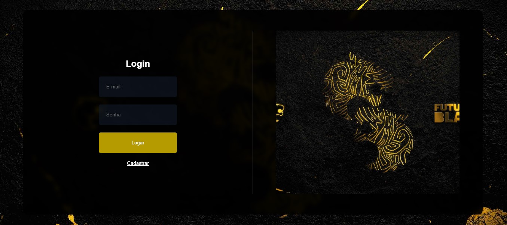
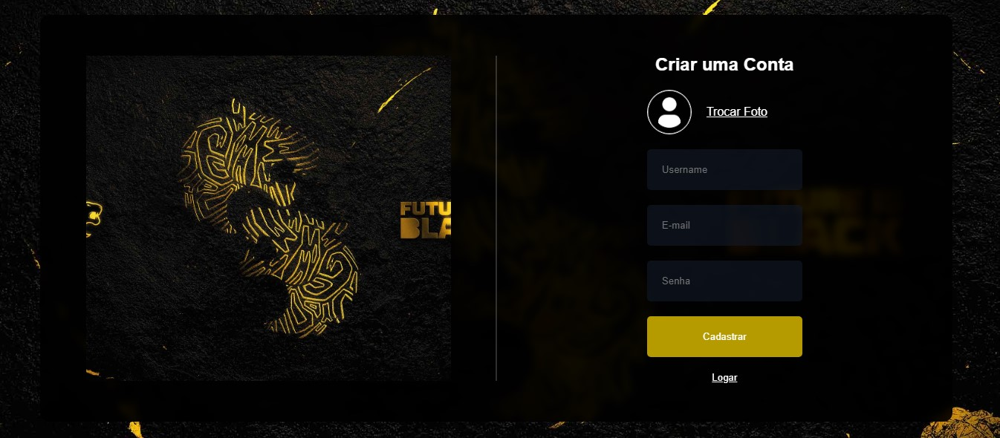
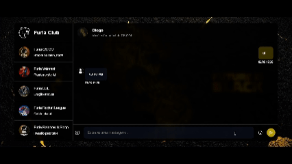

# 💬 Web Chat FURIA

**Web Chat FURIA** é uma aplicação de chat em tempo real desenvolvida para o processo seletivo da FURIA Tech. O projeto visa oferecer uma experiência de comunicação moderna e interativa, demonstrando habilidades em desenvolvimento full stack com foco em tempo real e usabilidade.

## ✨ Funcionalidades

- Envio e recebimento de mensagens em tempo real
- Interface leve e responsiva
- Sistema básico de autenticação via nome de usuário
- Chat
    - /ultima : Traz a última partida jogada.
    - /ultimas (número) : Traz as ultimas partidas jogadas de acordo com o número digitado.
    - /proxima : Traz a próxima partida que irá acontecer.
    - /proximas : Traz as próximas partidas que irão acontecer.

## 🛠️ Tecnologias Utilizadas

### Frontend (`/client`)
- HTML, CSS, JavaScript (React)
- WebSocket (via `socket.io-client`)

### Backend (`/server`)
- Node.js
- Express
- TypeScript
- WebSocket (via `Socket.IO`)
- CORS

## 📦 Instalação

### Pré-requisitos
- Node.js v18+
- npm (ou yarn)

### Passo a passo

Clone o repositório:
```bash
git clone https://github.com/DiogoWi/web-chat-furia.git
cd web-chat-furia
```

#### Backend

```bash
cd server
npm install
npm run dev
```

#### Frontend

Abra outro terminal:
```bash
cd client
npm install
npm run dev
```

O frontend estará disponível em: `http://localhost:5173`  
O backend rodará em: `http://localhost:3000`

## 🧩 Estrutura do Projeto

```
web-chat-furia/
├── client/  # Frontend React (Vite)
├── server/  # Backend Express (TypeScript + Socket.IO)
└── README.md
```

## 📸 Telas

### Login


### Cadastro


### Chat


## 🤝 Contribuindo

Contribuições são bem-vindas! Para contribuir:

1. Faça um fork do projeto
2. Crie uma branch: `git checkout -b minha-feature`
3. Commit suas alterações: `git commit -m 'feat: nova funcionalidade'`
4. Push para a branch: `git push origin minha-feature`
5. Abra um Pull Request

## ✍️ Autor

Desenvolvido por [Diogo Willian](https://github.com/DiogoWi) para o desafio técnico da **FURIA Tech**.